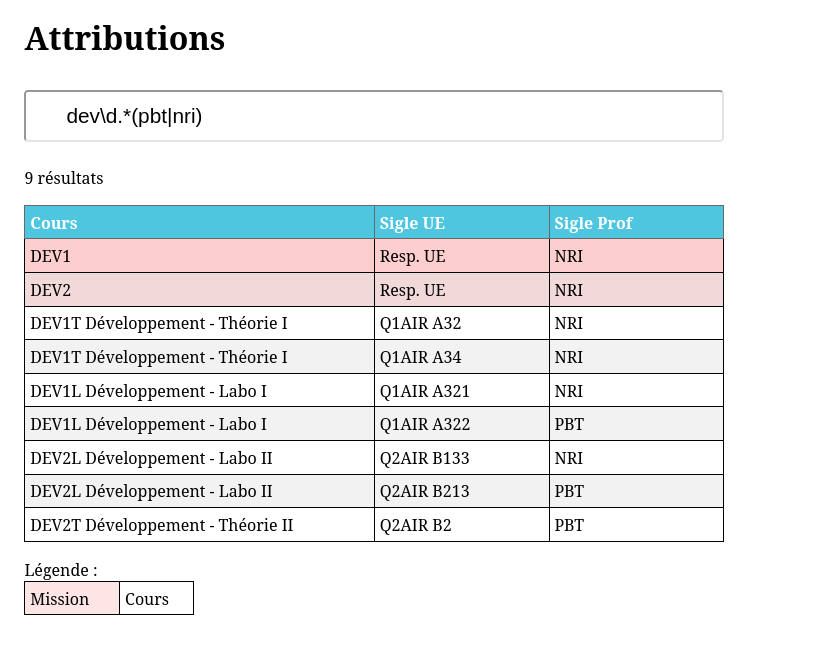

# Présentations des attributions

Une idée de _mdg_, réécrite par _pbt_ avec une touche de _nri_ pour afficher les attributions des enseignants et enseignantes avec la possibilité de faire une recherche.

<http://attributions.esi-bru.be>

**Fonctionnalités**

- Affichage sur base de deux fichiers textes contenant les attributions.
- Possibilité de filtrer sur une _regex_.

- _That's all folks_

L'**installation** se fait en publiant la branche principale sur un serveur web.

La mise à jour est aussi simple qu'un dépôt des fichiers Cours.txt et Missions.txt dans la branche `data` (sur <https://github.com/HEB-ESI/attributions>).

**Auteurs**

Mikaël Degeer  
Pierre Bettens  
Nicolas Richard  

Licence [WTFPL](http://www.wtfpl.net/about)

